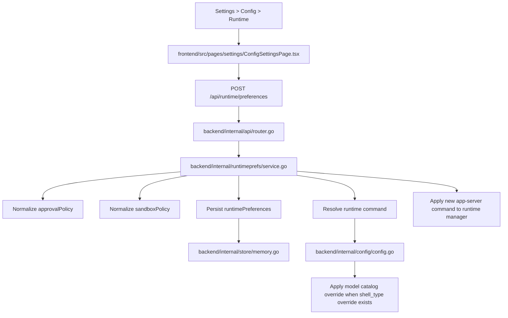
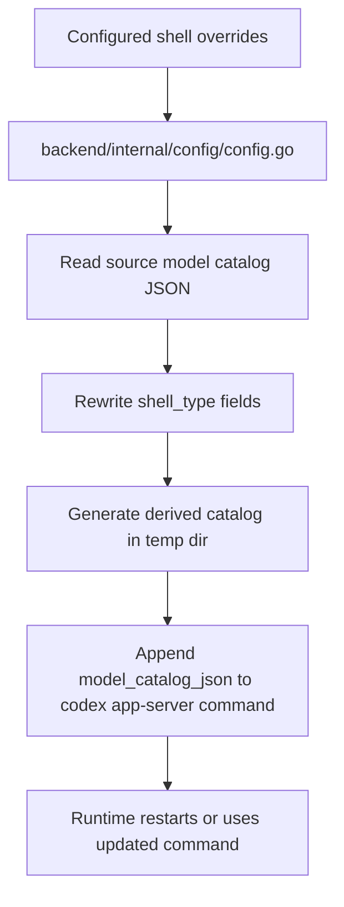
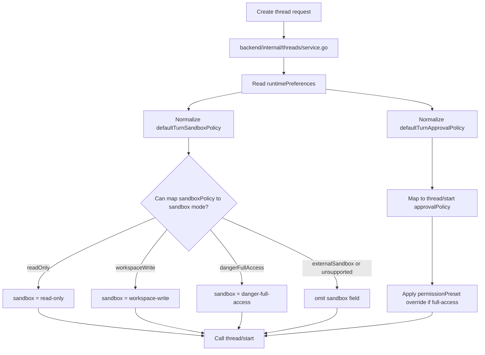

# Runtime Execution Controls

本文说明 `codex-server` 里三套相关但不同的控制面：

- `shell_type`
- `approvalPolicy`
- `sandboxPolicy`

核心结论：

- `shell_type` 只决定模型是否暴露 shell 能力，例如 `local_shell`
- `approvalPolicy` 决定审批策略
- `sandboxPolicy` 才决定 `turn/start` 和 `command/exec` 是否进入 Codex 自带沙箱

## 1. Configuration Save Flow



## 2. Data Model

当前 runtime preferences 分为两层：

### 2.1 Shell capability

- `modelCatalogPath`
- `defaultShellType`
- `modelShellTypeOverrides`

这层只影响模型目录和 `shell_type`。

### 2.2 Execution control

- `defaultTurnApprovalPolicy`
- `defaultTurnSandboxPolicy`
- `defaultCommandSandboxPolicy`

这层只影响运行期请求 payload。

## 3. Shell Type Flow



说明：

- 这里不会修改 `turn/start` 的 `sandboxPolicy`
- `shell_type = local` 不等于无沙箱

## 4. Thread Create Flow

`thread/start` 只能接收粗粒度的 `sandbox` mode，不能直接接完整 `sandboxPolicy` 对象。



当前映射规则：

- `readOnly` -> `read-only`
- `workspaceWrite` -> `workspace-write`
- `dangerFullAccess` -> `danger-full-access`
- `externalSandbox` -> `thread/start` 无法精确表达，`codex-server` 不强制下发 `sandbox`

这意味着：

- 如果默认 turn sandbox 设为 `externalSandbox`，线程创建阶段不会精确覆盖
- 但首次 `turn/start` 时会下发完整 `sandboxPolicy`

## 5. Turn Start Flow

```mermaid
flowchart TD
    A[Send message] --> B[POST /threads/{threadId}/turns]
    B --> C[backend/internal/turns/service.go]
    C --> D[Read runtimePreferences]
    D --> E[Apply defaultTurnApprovalPolicy]
    D --> F[Apply defaultTurnSandboxPolicy]
    C --> G[Apply model and reasoning overrides]
    C --> H{permissionPreset == full-access?}
    H -->|No| I[Keep runtime defaults]
    H -->|Yes| J[approvalPolicy = never]
    H -->|Yes| K[sandboxPolicy = dangerFullAccess]
    I --> L[Call turn/start]
    J --> L
    K --> L
```

优先级：

1. 当前请求的 `permissionPreset`
2. 服务级默认 `defaultTurnApprovalPolicy` / `defaultTurnSandboxPolicy`
3. Codex 自身默认配置

## 6. Command Exec Flow

```mermaid
flowchart TD
    A[Terminal panel start command] --> B[POST /workspaces/{workspaceId}/commands]
    B --> C[backend/internal/execfs/service.go]
    C --> D[Read runtimePreferences]
    D --> E{defaultCommandSandboxPolicy exists?}
    E -->|Yes| F[Use configured sandboxPolicy]
    E -->|No| G[Fallback to dangerFullAccess]
    F --> H[Call command/exec]
    G --> H
```

说明：

- `command/exec` 现在不再只靠硬编码
- 默认回退仍然是 `{"type":"dangerFullAccess"}`

## 7. Thread Shell Command Flow

右侧 Workbench Tools 已支持在 UI 里切换到 `thread/shellCommand` 模式。

```mermaid
flowchart TD
    A[Workbench Tools > thread/shellCommand] --> B[frontend rail command form]
    B --> C[POST /threads/{threadId}/shell-command]
    C --> D[backend/internal/api/router.go]
    D --> E[backend/internal/threads/service.go]
    E --> F{Thread loaded?}
    F -->|Yes| G[Call thread/shellCommand]
    F -->|No| H[Resume thread]
    H --> G
    G --> I[Output streams into thread events and message flow]
```

说明：

- 这条链路不走 `command/exec`
- 它不会继承 thread 的 sandbox policy，而是直接 full access
- 输出回到 thread/live events，不会进入 terminal dock session

## 8. Supported Settings Examples

### 7.1 Disable Codex sandbox for turns

```json
{
  "defaultTurnApprovalPolicy": "never",
  "defaultTurnSandboxPolicy": {
    "type": "dangerFullAccess"
  }
}
```

### 7.2 Disable Codex sandbox for command exec

```json
{
  "defaultCommandSandboxPolicy": {
    "type": "dangerFullAccess"
  }
}
```

### 7.3 Use external sandbox

```json
{
  "defaultTurnSandboxPolicy": {
    "type": "externalSandbox",
    "networkAccess": "enabled"
  },
  "defaultCommandSandboxPolicy": {
    "type": "externalSandbox",
    "networkAccess": "enabled"
  }
}
```

## 9. Practical Notes

- `thread/shellCommand` 仍然是另一条独立能力，它本身是 unsandboxed full access
- 当前项目的终端面板走的是 `command/exec`，不是 `thread/shellCommand`
- 如果你要统一“新线程创建后第一条消息之前”的权限语义，要注意 `thread/start` 的 sandbox 表达能力弱于 `turn/start`
- 如果需要最精确的运行期覆盖，应以 `turn/start` 和 `command/exec` 的 `sandboxPolicy` 为准
